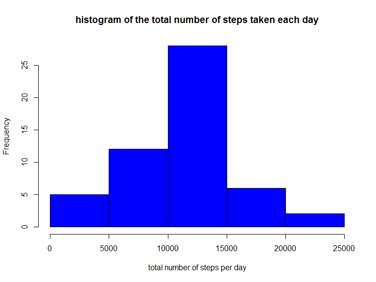
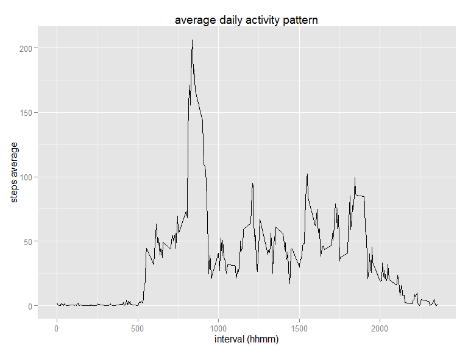
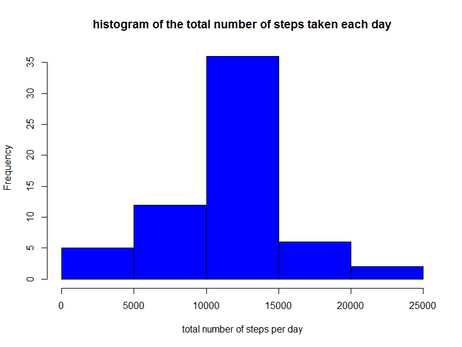
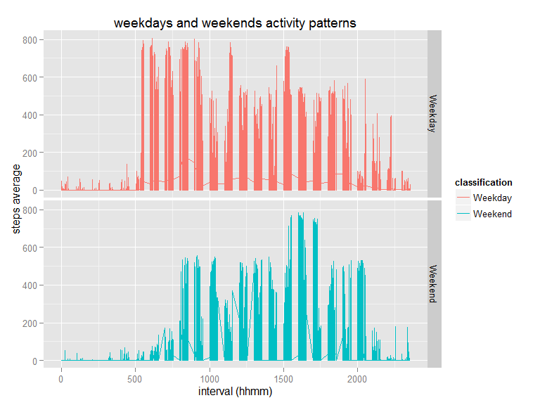

# Reproducible Research: Peer Assessment 1
diebugger  
This is my submission of the peer assessment for this session.

## Loading and preprocessing the data
In order to load and preprocess the data, the following libraries are needed:  
- dplyr  
- knitr  
- lubridate  
- ggplot2  


```r
library("dplyr")
library("knitr")
library("lubridate")
library("ggplot2")
Sys.setlocale(category = "LC_ALL", locale = "US")
```

Here we start reading the dataset from the ZIP archive provided:  

```r
unzip("activity.zip")
activity <- read.csv("activity.csv", header = T)
activity$date <- as.Date.factor(activity$date)
activity <- tbl_df(activity)
```
Then, I want to store data without NAs in a different dataset:  

```r
clean_activity <- activity[!is.na(activity$steps),]
```

## What is mean total number of steps taken per day?
From the cleaned data above, we can produce the following histogram:  

```r
clean_activity <- clean_activity %>% group_by(date)
stepsByDay <- clean_activity %>% summarise_each(funs(sum))
stepsByDay <- stepsByDay[, 1:2]
hist(
  stepsByDay$steps, 
  xlab = "total number of steps per day", 
  main = "histogram of the total number of steps taken each day", 
  col = "blue"
)
```

 

Analyzing the data, we found that mean and median values are:  

```r
mean(stepsByDay$steps)
```

```
## [1] 10766.19
```

```r
median(stepsByDay$steps)
```

```
## [1] 10765
```

## What is the average daily activity pattern?
On a daily basis, we can average all the activities on each time interval, thus creating an activity pattern:  

```r
# group by interval
clean_activity <- clean_activity %>% group_by(interval)
# calculate mean steps and remove unused variables
stepsByInterval <- clean_activity %>% summarise_each(funs(mean))
stepsByInterval <- stepsByInterval[, 1:2]
# line plot
qplot(stepsByInterval$interval, stepsByInterval$steps, 
      geom = "line", 
      main = "average daily activity pattern", 
      xlab = "interval (hhmm)", 
      ylab = "steps average"
)
```

 

From the plot above, we see that the peak of activity is at interval 835, that means 8:35 AM.  
The number of steps for the absolute peak on the plot is:  

```r
# extract max steps interval
stepsByInterval[which.max(stepsByInterval$steps),]
```

```
## Source: local data frame [1 x 2]
## 
##   interval    steps
## 1      835 206.1698
```

## Imputing missing values
So far, we have processed a clean subset of the original dataset.  
I want to use all dataset, imputing the not available values: to do this, for each missing value I will insert the average value for the same interval, calculated on an all-days basis.  


```r
# Calculate and report the total number of missing values in the dataset (i.e. the total number of rows with NAs)
index <- which(is.na(activity$steps))
length(index)

# Create a new dataset that is equal to the original dataset but with the missing data filled in.
activity_filled <- activity

# Here I fill the avg values into NAs
for (i in index)
{
  interval_ix = as.integer(activity_filled[i,3])
  avg_step = as.numeric(stepsByInterval[stepsByInterval$interval == interval_ix, 2])
  activity_filled[i,1] = avg_step
}
```

Using the imputed values, here's the new histrogram we got:  

```r
# Make a histogram of the total number of steps taken each day 
# and Calculate and report the mean and median total number of steps taken per day. 
activity_filled <- activity_filled %>% group_by(date)
stepsByDayFilled <- activity_filled %>% summarise_each(funs(sum))
stepsByDayFilled <- stepsByDayFilled[, 1:2]

hist(
  stepsByDayFilled$steps, 
  xlab = "total number of steps per day", 
  main = "histogram of the total number of steps taken each day", 
  col = "blue"
)
```

 

**Do these values differ from the estimates from the first part of the assignment?**  
The difference between the two historgrams is small, but looking deeper we can extract some important values that will explain the changes:  

```r
# mean and median values
mean(stepsByDayFilled$steps)
median(stepsByDayFilled$steps)
```

```
## [1] 10766.19
## [1] 10766.19
```

In this way, I have recovered 8 observations and putting the average value makes median value levels up till mean value. 
Imputing the missing values made the new dataset differ from the original in matter of number of observations, median value and standard deviation:  

- median value raised, 3rd quartile lowered  

```r
summary(stepsByDay)
```

```
##       date                steps      
##  Min.   :2012-10-02   Min.   :   41  
##  1st Qu.:2012-10-16   1st Qu.: 8841  
##  Median :2012-10-29   Median :10765  
##  Mean   :2012-10-30   Mean   :10766  
##  3rd Qu.:2012-11-16   3rd Qu.:13294  
##  Max.   :2012-11-29   Max.   :21194
```

```r
summary(stepsByDayFilled)
```

```
##       date                steps      
##  Min.   :2012-10-01   Min.   :   41  
##  1st Qu.:2012-10-16   1st Qu.: 9819  
##  Median :2012-10-31   Median :10766  
##  Mean   :2012-10-31   Mean   :10766  
##  3rd Qu.:2012-11-15   3rd Qu.:12811  
##  Max.   :2012-11-30   Max.   :21194
```
- standard deviation has been reduced  

```r
sd(stepsByDay$steps)
```

```
## [1] 4269.18
```

```r
sd(stepsByDayFilled$steps)
```

```
## [1] 3974.391
```

## Are there differences in activity patterns between weekdays and weekends?
Analyzing the datset according to the classification "Weekday" or "Weekend", we notice a significant difference in the activity pattern.  

```r
# Create a new factor variable in the dataset with two levels – “weekday” and “weekend” 
# indicating whether a given date is a weekday or weekend day.
days <- weekdays(activity_filled$date)
days <- ifelse(days %in% c("Saturday", "Sunday"), c("Weekend"), c("Weekday"))
days <- as.factor(days)
activity_filled$classification <- days
```

This difference consists in the shift of the time period when an intense activity is performed: as shown in the chart below, during weekdays the most significant activity is performed during morning time, while during weekends we notice an increment in the afternoon hours.  


```r
# Make a panel plot containing a time series plot (i.e. type = "l") of the 5-minute interval (x-axis) 
# and the average number of steps taken, averaged across all weekday days or weekend days (y-axis).
g <- ggplot(activity_filled, aes(interval, steps))
g + geom_line() + aes(color = classification) + facet_grid(classification ~ .) + labs(title = "weekdays and weekends activity patterns") + labs(x = "interval (hhmm)", y = "steps average")
```

 
